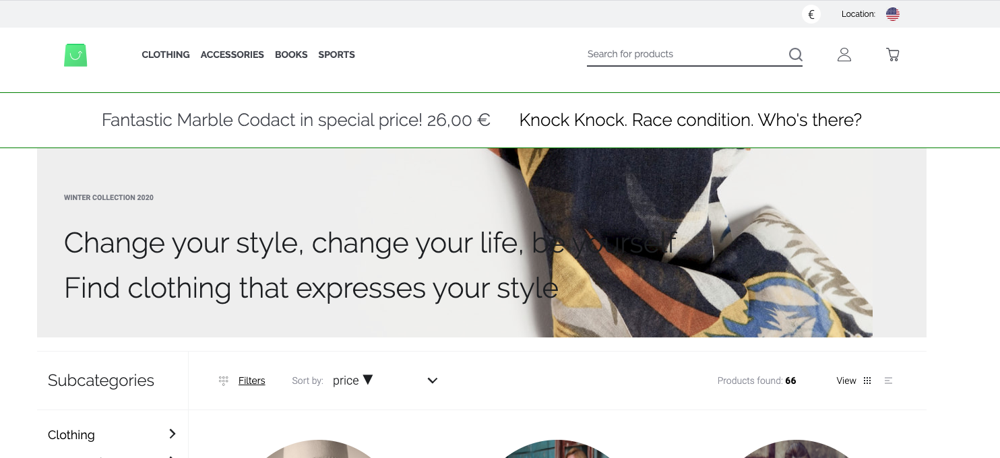

# Plugins

`shopware-pwa init` will take the resources from each plugin `Resources/app/pwa` directory and place it in your project. Plugin installation date determines whether it's "on top" of other plugins (newest installation date means that plugin is on top if there are more than one plugin injected to theme slot)

## Creating plugin

Plugin development can be easily made locally. First, we need to choose where would we want to plug into. To see all available plugin slots we may want to select `yes` during `shopware-pwa init` command when it asks to allow dev mode.


It shows then a button in the footer, which allows us to turn on Dev mode, and see all plugin slots in theme.


it will show us available slots on the theme, and you can click on any of them to see its name in the console


### Local plugin

Let's create `cool-promotion-plugin`, which can display our special product under the top header.
We're creating following files inside your project.


```
.
├── sw-plugins                  <- Local folder for developing and overriding plugins
│   ├── local-plugins.json      <- Config file to manage the order of plugins
│   ├── cool-promotion-plugin   <- your local plugin directory, maybe more of them
│   │   ├── config.json         <- plugin configuration
│   │   └── *.vue               <- vue files for your plugin
│   ├── another-local-plugin
│   │   ├── config.json
│   │   └── *.vue
```

so in `local-plugins.json` we're activating our new plugin

```json
{
  "cool-promotion-plugin": true
}
```

::: details In depth of `local-plugin.json`
This file allows us to set if plugin is active or not (`true/false`). Plugins importance rule is the same as for the plugins from shopware instance - latest installed is always on top of specific slot. Same in this file, latest key is the most important one.
:::

inside `cool-promotion-plugin/config.json` we need to put

- slot, in which we want to inject
- vue file, which should be displayed there

In the single plugin, we may inject in multiple plugin slots. Let's inject our `main.vue` file into `top-header-after` slot.

```json{4,5}
{
  "slots": [
    {
      "name": "top-header-after",
      "file": "main.vue"
    }
  ],
  "settings": {}
}
```

so our `main.vue` file can be as simple as

```vue
<template>
  <div class="cool-promotion-plugin">
    <h3>Hello from plugin!</h3>
  </div>
</template>
<script>
export default {
  name: "CoolPromotionPlugin",
  data() {
    return {};
  },
};
</script>
<style lang="scss" scoped>
.cool-promotion-plugin {
  display: flex;
  justify-content: center;
  border: 1px solid green;
}
</style>
```

we run `shopware-pwa plugins`, and we see the effect


Let's put some logic there, and we're getting the cheapest product and displaying it with link.

```vue
<template>
  <div class="cool-promotion-plugin">
    <!-- we can link to our product product -->
    <nuxt-link
      :to="getProductLink"
      v-if="product"
      class="cool-promotion-plugin__link"
    >
      <h3>{{ getName }} in special price! {{ getPrice | price }}</h3>
    </nuxt-link>
  </div>
</template>
<script>
import { getProducts } from "@shopware-pwa/shopware-6-client";
import {
  getProductName,
  getProductRegularPrice,
  getProductUrl,
} from "@shopware-pwa/helpers";

export default {
  name: "CoolPromotionPlugin",
  data() {
    return {
      product: null,
    };
  },
  async mounted() {
    // let's get the cheapest product
    const productsResult = await getProducts({
      sort: {
        field: "price",
        desc: false,
      },
      pagination: {
        limit: 1,
      },
    });
    this.product = productsResult.data[0];
  },
  computed: {
    getName() {
      return getProductName({ product: this.product });
    },
    getProductLink() {
      return getProductUrl(this.product);
    },
    getPrice() {
      return getProductRegularPrice({ product: this.product });
    },
  },
};
</script>
<style lang="scss" scoped>
.cool-promotion-plugin {
  display: flex;
  justify-content: center;
  border: 1px solid green;

  &__link {
    padding: 20px 5px;
    min-height: 30px;
    margin-right: 2rem;
  }
}
</style>
```

so we achieved this:


### Nesting plugins

Okay, but what if we have two or more plugins for our `top-header-after` slot?
Always the newest installed plugin in shopware instance is on top. But local plugins are over them. The easiest way is to picture that. On shopware instance, we have our HelloCody plugin, which displays random quotes. It injects into `top-header-after` slot as well. So we overrode that.

:::warning Always provide a slot for other plugins
We should always provide slots for other plugins; otherwise, we're blocking slot only for our plugin.
:::

Okay, so how we can allow other plugins to display as well if we're in `top-header-after`? We're providing Vue's default slot in our component, as simple as that:

```vue {11}
<template>
  <div class="cool-promotion-plugin">
    <!-- we can link to our product product -->
    <nuxt-link
      :to="getProductLink"
      v-if="product"
      class="cool-promotion-plugin__link"
    >
      <h3>{{ getName }} in special price! {{ getPrice | price }}</h3>
    </nuxt-link>
    <slot />
  </div>
</template>
```

So this allows our installed plugin to show up and present itself.



In this case, it shows a random plugin but it could be as well another promotion plugin. You always decide where to show slot with another plugin if exists. There are a lot more use cases. Like social login button - you're doing plugin for Facebook, but others may do plugins for Google, GitHub etc.
