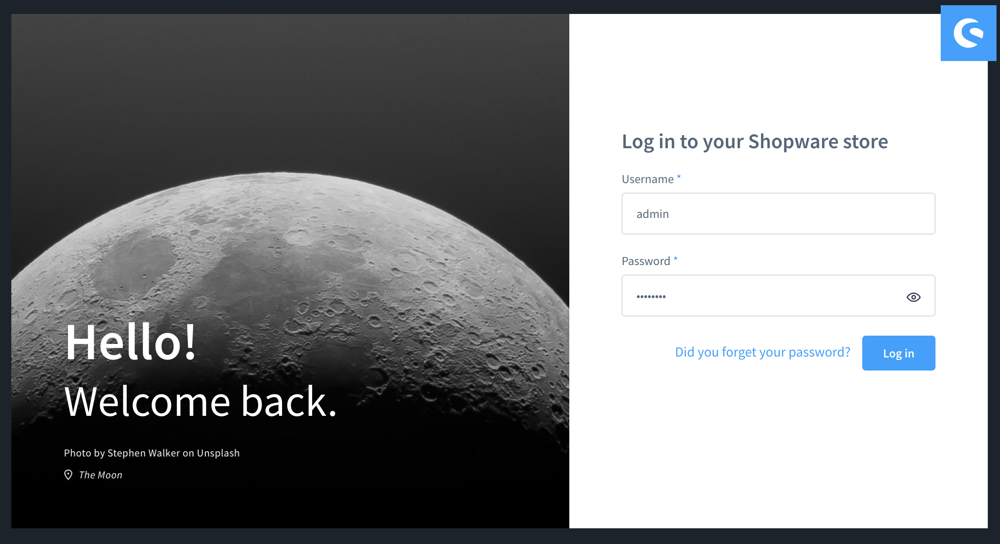

# Prepare Shopware

::: tip
This whole guide is also available as a [video tutorial](https://www.youtube.com/watch?v=--jUufVubyE) on Youtube.

Some paths and namings might not be 100% up to date in the video, so be aware of that.
:::

In order to make Shopware work with shopware-pwa you have to follow a few simple steps.

## Installation

Make sure your current Shopware version is 6.1.5 or higher.

Within your Shopware root directory run:

```bash
composer require shopware-pwa/shopware-pwa
```

This will download a shopware plugin named `SwagShopwarePwa`, adding some readonly endpoints required to allow for performant rendering of the PWA.

After that run

```
bin/console plugin:refresh && bin/console plugin:install --activate SwagShopwarePwa
```

This will install and activate your plugin.

Now your instance is ready to go.

## Credentials

When running the CLI init function `shopware-pwa init` or editing the `showpare-pwa.config.js` directly, you might be wondering where to get the access token from.

An access token is usually associated with a "Sales Channel". These are defined in you Shopware instance. Log in to your Shopware instance - by default it uses the `admin` and `shopware` credentials.



Once you are logged in, you can find the configured Sales Channels on the left side of your navigation bar. 

Select the `Storefront` sales channel or any sales channel that you've configured manually and the scroll down to the `API access` section. Copy the API access key and you're good to continue with your PWA setup.

[Continue with the PWA setup](/landing/getting-started#usage)